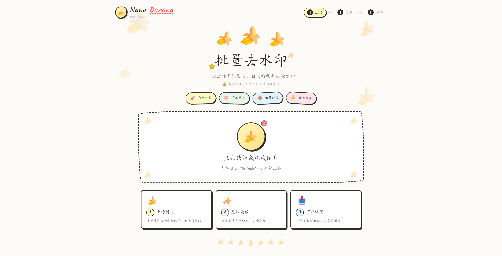
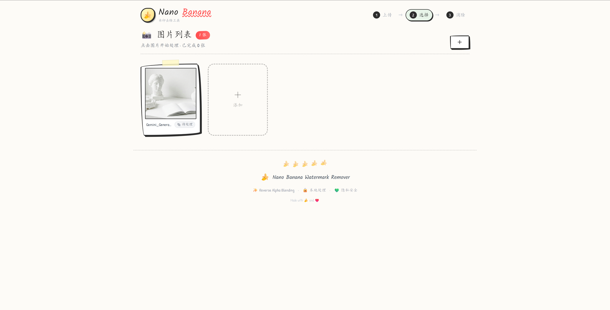
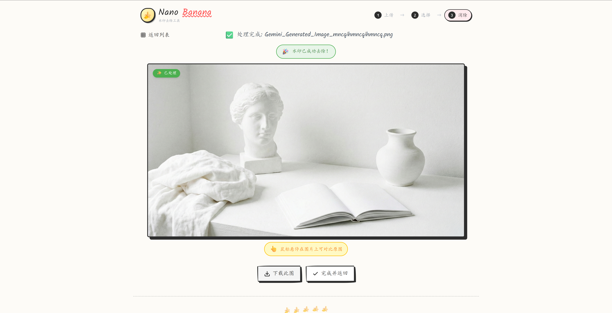

# 🍌 Nano Banana Watermark Remover

专门用于去除 **Nano Banana** 水印的批量处理工具，使用 Reverse Alpha Blending 算法，本地处理保护隐私。

🔗 **在线体验**：[https://banana-watermark.vercel.app/](https://banana-watermark.vercel.app/)

> ⚠️ **注意**：本工具仅支持去除 Nano Banana 特定水印，不适用于其他类型的水印。

## 📸 截图预览

### 首页 - 开场动画


### 上传页面


### 图片列表


### 处理结果


## ✨ 特性

- 🎯 **专属定制** - 专门针对 Nano Banana 水印优化
- 🚀 **自动检测** - 智能识别图片右下角的 Nano Banana 水印
- � ***批量处理** - 一次上传多张图片，批量去除水印
- 🔒 **本地处理** - 所有处理在浏览器本地完成，图片不会上传到服务器
- 🎨 **手绘风格 UI** - 可爱的香蕉主题界面设计
- � **响应栈式设计** - 支持桌面和移动设备

## 🎯 适用范围

| 支持 | 不支持 |
|------|--------|
| ✅ Nano Banana 水印 | ❌ 其他平台水印 |
| ✅ 右下角固定位置水印 | ❌ 随机位置水印 |
| ✅ 白色半透明水印 | ❌ 彩色水印 |

## 🛠️ 技术栈

- **React 18** - 前端框架
- **Vite** - 构建工具
- **Tailwind CSS** - 样式框架
- **Lucide React** - 图标库

## 🔬 算法原理

使用 **Reverse Alpha Blending** 算法去除水印：

```
Original = (Composite - Watermark × α) / (1 - α)
```

其中：
- `Composite` - 带水印的图片
- `Watermark` - 水印图层（白色）
- `α` - 水印透明度
- `Original` - 还原后的原图

## 🚀 快速开始

### 安装依赖

```bash
npm install
```

### 启动开发服务器

```bash
npm run dev
```

### 构建生产版本

```bash
npm run build
```

## 📁 项目结构

```
├── public/
│   └── assets/
│       ├── mask_48.png    # 48px Nano Banana 水印 Mask
│       ├── mask_96.png    # 96px Nano Banana 水印 Mask
│       └── banana.png     # 香蕉图标
├── src/
│   ├── components/
│   │   ├── HandDrawnButton.jsx  # 手绘风格按钮
│   │   └── PhotoCard.jsx        # 图片卡片组件
│   ├── utils/
│   │   ├── maskUtils.js   # 水印处理核心算法
│   │   └── imageUtils.js  # 图片工具函数
│   ├── App.jsx            # 主应用组件
│   ├── constants.js       # 常量配置
│   ├── index.css          # 全局样式
│   └── main.jsx           # 入口文件
└── README.md
```

## ⚙️ 配置说明

### Mask 配置

在 `src/constants.js` 中配置水印 Mask：

```javascript
export const MASK_CONFIGS = [
  { size: 96, path: '/assets/mask_96.png', margin: 64 },
  { size: 48, path: '/assets/mask_48.png', margin: 32 }
];
```

- `size` - Mask 尺寸标识（对应不同分辨率图片）
- `path` - Mask 图片路径
- `margin` - 水印距离右下角的边距

### Mask 选择逻辑

- 图片宽高都 > 1024px → 使用 96px Mask
- 其他情况 → 使用 48px Mask

## 📖 使用说明

1. **上传图片** - 点击上传区域或拖拽带有 Nano Banana 水印的图片
2. **选择处理** - 在图片列表中点击要处理的图片
3. **自动处理** - 系统自动检测并去除 Nano Banana 水印
4. **下载结果** - 处理完成后下载去水印后的图片

## 🤝 贡献

欢迎提交 Issue 和 Pull Request！

## 📄 License

MIT License
 